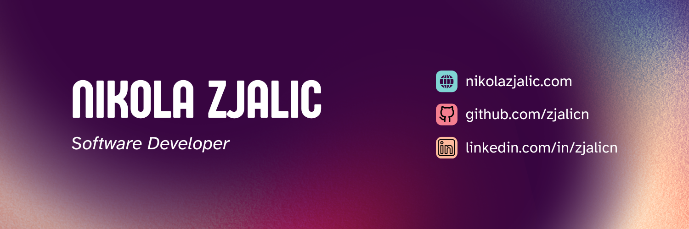

[![LinkedIn][linkedin-shield]][linkedin-url]

[Resumé](https://fg92krreal8mypv5.public.blob.vercel-storage.com/nikola-zjalic-cv-UEbT0iVY9pHTRUQAIyXqDCjukPuErU.pdf) //
[Portfolio Site](https://www.nikolazjalic.com)

<!--
[![GitHub][github-shield]][github-url]

## Projects

### Lumiere

### Pulse VST

### Oxide VST
-->
<!--
## 💻 Recent Projects

### [TreeLink](https://tree-link-three.vercel.app/)
[![Next][Next.js]][Next-url]
- A fully functional Linktree clone which allows users to sign up, create custom profile pages which display custom user links and theme settings
- User sign up / authentication, dynamic profile generation, and custom theme management.
- Track clicks on links and display metrics about the user's audience engagement

### [SaaS Starter](https://saas-starter-one.vercel.app/)
[![Next][Next.js]][Next-url]
<!-- [![Product Name Screen Shot][product-screenshot]][songmaps-url] -->
<!--
- A fully functional template with all the components and functionality needed to build a SaaS on top of
- User authentication and email verification using sessions, validated against authenticated routes and Api calls
- Integration with Stripe Api and Webhooks, fully functional User Settings page
- Database store for all User information and bridge tables to Stripe products, subscriptions, etc and Blob storage for user uploaded files

### [Song Maps][songmaps-url] 
[![Angular][Angular.io]][Angular-url]
<!-- [![Product Name Screen Shot][product-screenshot]][songmaps-url] -->
<!--
- A songwriting tool to provide musicians with tools to help with songwriting and manage their song releases

### [Wav Planet][wavplanet-url]
[![React][React.js]][React-url]
<!-- [![Product Name Screen Shot][product-screenshot]][wavplanet-url] -->
<!--
- A marketplace for musicians to sell sample packs and other merchandise

<!--
**zjalicn/zjalicn** is a ✨ _special_ ✨ repository because its `README.md` (this file) appears on your GitHub profile.

Here are some ideas to get you started:

- 🔭 I’m currently working on ...
- 🌱 I’m currently learning ...
- 👯 I’m looking to collaborate on ...
- 🤔 I’m looking for help with ...
- 💬 Ask me about ...
- 📫 How to reach me: ...
- 😄 Pronouns: ...
- ⚡ Fun fact: ...
-->

<!-- Reference Links -->
<!-- Project Urls -->
[songmaps-url]: https://github.com/zjalicn/songmaps-ui
[wavplanet-url]: wavplanet.com

<!-- Shields -->
[contributors-shield]: https://img.shields.io/github/contributors/othneildrew/Best-README-Template.svg?style=for-the-badge
[contributors-url]: https://github.com/othneildrew/Best-README-Template/graphs/contributors
[forks-shield]: https://img.shields.io/github/forks/othneildrew/Best-README-Template.svg?style=for-the-badge
[forks-url]: https://github.com/othneildrew/Best-README-Template/network/members
[stars-shield]: https://img.shields.io/github/stars/othneildrew/Best-README-Template.svg?style=for-the-badge
[stars-url]: https://github.com/othneildrew/Best-README-Template/stargazers
[issues-shield]: https://img.shields.io/github/issues/othneildrew/Best-README-Template.svg?style=for-the-badge
[issues-url]: https://github.com/othneildrew/Best-README-Template/issues
[license-shield]: https://img.shields.io/github/license/othneildrew/Best-README-Template.svg?style=for-the-badge
[license-url]: https://github.com/othneildrew/Best-README-Template/blob/master/LICENSE.txt
[linkedin-shield]: https://img.shields.io/badge/-LinkedIn-black.svg?style=for-the-badge&logo=linkedin&colorB=555
[linkedin-url]: https://linkedin.com/in/nzjalic
[github-shield]: https://img.shields.io/badge/github-%23121011.svg?style=for-the-badge&logo=github&logoColor=white
[github-url]: https://github.com/zjalicn
[product-screenshot]: screenshot.png

[Next.js]: https://img.shields.io/badge/next.js-000000?style=for-the-badge&logo=nextdotjs&logoColor=white
[Next-url]: https://nextjs.org/
[React.js]: https://img.shields.io/badge/React-20232A?style=for-the-badge&logo=react&logoColor=61DAFB
[React-url]: https://reactjs.org/
[Angular.io]: https://img.shields.io/badge/Angular-DD0031?style=for-the-badge&logo=angular&logoColor=white
[Angular-url]: https://angular.io/

